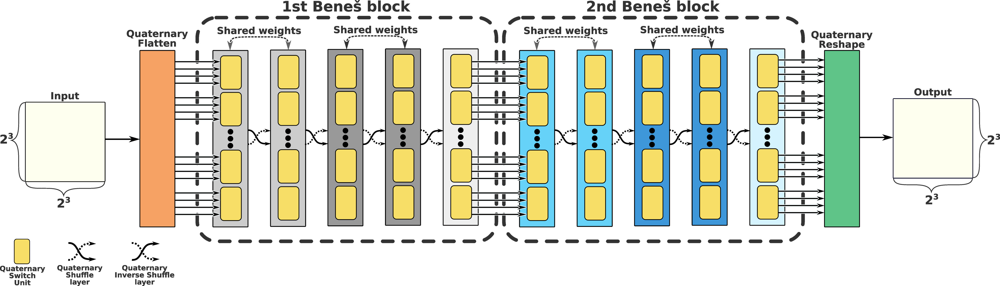
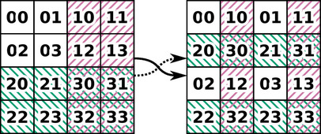
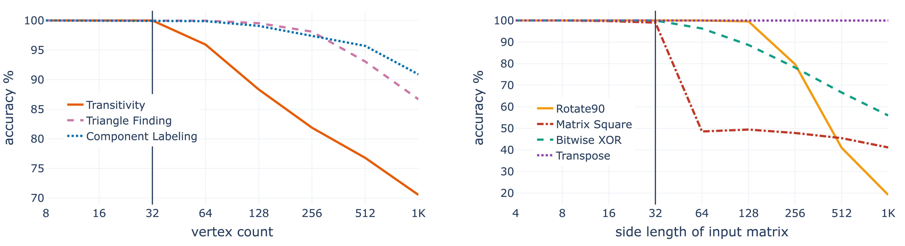
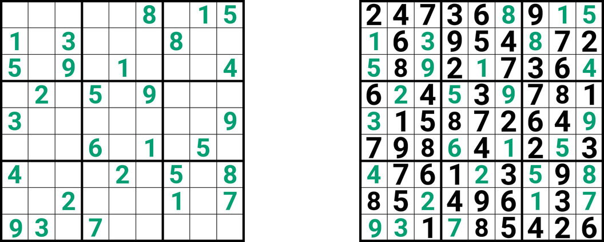
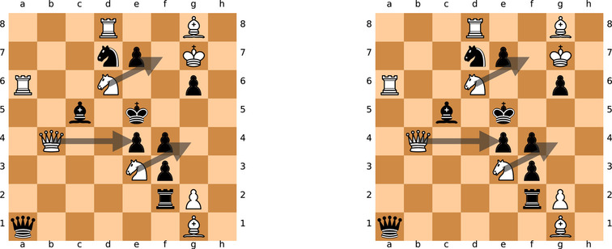

# Official _TensorFlow_ implementation of Switchblade model

This repository contains the official _TensorFlow_ implementation of the following paper:

>**Switchblade - a Neural Network for Hard 2D Tasks**
>
> by Emīls Ozoliņš, Kārlis Freivalds, Agris Šostaks
>
> [[arXiv]()]
>
>Abstract: _Convolutional neural networks have become the main tools for
> processing two-dimensional data. They work well for images, yet convolutions
> have a limited receptive field that prevents its applications to more
> complex 2D tasks. We propose a new neural network model, named Switchblade,
> that can efficiently exploit long-range dependencies in 2D data and
> solve much more challenging tasks. It has close-to-optimal  O(n² log n) 
>complexity for processing n×n data matrix. Besides the common image
> classification and segmentation,  we consider a diverse set of algorithmic 
>tasks on matrices and graphs. Switchblade can infer highly complex matrix 
>squaring and graph triangle finding algorithms purely from input-output
> examples. We show that our model is likewise suitable for logical 
>reasoning tasks -- it attains perfect accuracy on Sudoku puzzle solving.
> Additionally, we introduce a new dataset for predicting the checkmating
> move in chess on which our model achieves 72.5% accuracy._

## What is _Switchblade_?

Switchblade is generalization of [Neural Shuffle-Exchange](https://github.com/LUMII-Syslab/shuffle-exchange) networks to two dimensions. 
It is suitable for broad range of problems that can be represented as matrix. Switchblade model
can induce O(n^2 log n) time complexity, where n is length of matrix side, algorithms and model long-range dependencies.

Switchblade model consists of cascaded Quaternary Switch and Quaternary Shuffle layers, that forms
Beneš blocks. Here model structure is represented:

Quaternary Switch layer divides inpute elements into tuples of 4 and the applies
Quaternary Switch Unit (QSU) to each tuple. QSU is a learnable
4-to-4 function, derived from [Residual Switch Unit](https://github.com/LUMII-Syslab/RSE), and is given as:

The Quaternary Shuffle layer rearranges elements according to cyclic base-4 digit permutation.
Quaternary Shuffle permutation can be interpreted as splitting matrix rows into two halves 
(white and green) and interleaving the halves, then applying the same
transformation to columns (white and red). 
Example permuation on 4×4 matrix:

## Preview Of Results
We evaluate the Switchblade model on several 2D tasks. For image tasks, we chose two widely used benchmarks: CIFAR-10 image classification and CityScapes semantic segmentation. But our main emphasis is on hard, previously unsolved tasks: algorithmic tasks on matrices and graphs and logical reasoning tasks -- solving Sudoku puzzle and predicting the mating move in chess. All tasks was trained and evaluated on one Nvidia T4 GPU card using softmax cross-entropy loss.

### Algorithmic tasks on matrices:
We create new datasets for 2D algorithmic tasks, that is tasks where input/output data can be represented as matrix.
For matrix tasks, we chose transpose of a matrix (_Transpose_), matrix rotation by 90 degrees (_Rotate90_), elementwise XOR of two matrices (_Bitwise XOR_) and matrix multiplication by itself (_Matrix Squaring_). For graph tasks, we chose transitive path finding (_Transitivity_), connected component labaling (_Component Labeling_) and triangle labaling in the graph (_Triangle Finding_). In all graph tasks, graphs are represented as adjacency matrices. Dataset generators for all tasks are available in [data folder](data/).

We train Switchblade model on up to inputs of size 32×32 and evaluated generalization on up to size 1024×1024. Generalizatio results of Switchblade model on algorithmic tasks:
 

###  Sudoku puzzle:

### Mate-In-One chess dataset:

## Running experiments
See [wiki page](https://github.com/LUMII-Syslab/Switchblade/wiki/Running-experiments) for tutorial for running experiments. 
