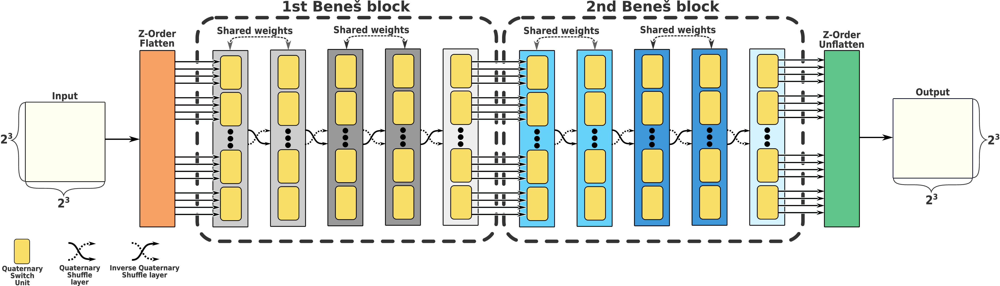
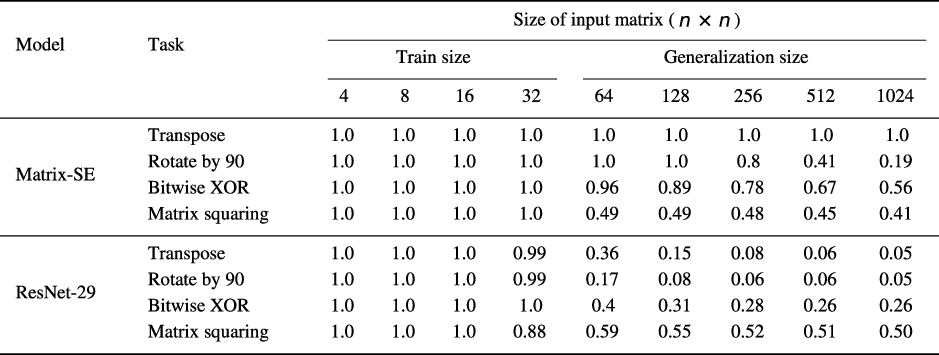
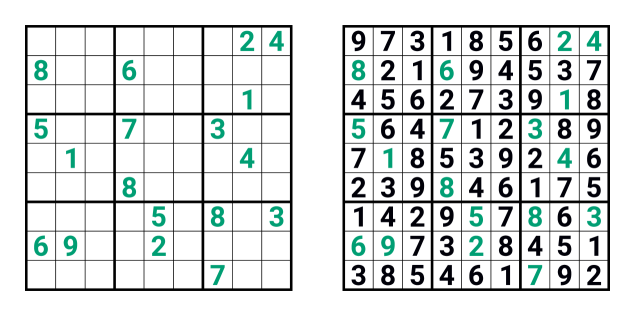
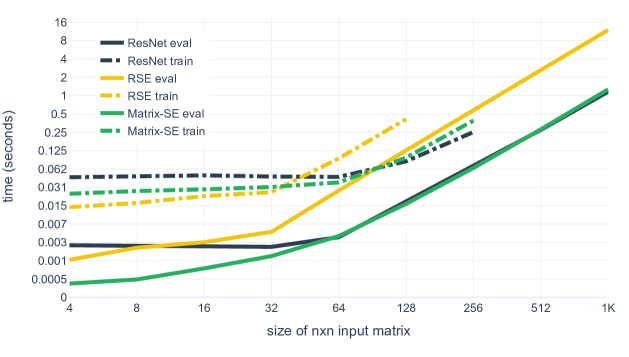

# Official _TensorFlow_ implementation of Matrix Shuffle-Exchange model

This repository contains the official _TensorFlow_ implementation of the following paper:

>**Matrix Shuffle-Exchange Networks for Hard 2D Tasks**
>
> by Emīls Ozoliņš, Kārlis Freivalds, Agris Šostaks
>
> [[arXiv](https://arxiv.org/abs/2006.15892)]
>
>Abstract: _Convolutional neural networks have become the main tools for processing two-dimensional data.
> They work well for images, yet convolutions have a limited receptive field that prevents its applications 
> to more complex 2D tasks. We propose a new neural model, called Matrix Shuffle-Exchange network, 
> that can efficiently exploit long-range dependencies in 2D data and has comparable speed to a convolutional
> neural network. It is derived from  Neural Shuffle-Exchange network and has O(log n) layers and O(n² log n) 
> total time and space complexity for processing a n×n data matrix. We show that the Matrix Shuffle-Exchange 
> network is well-suited for algorithmic and logical reasoning tasks on matrices and dense graphs, exceeding convolutional
> and graph neural network baselines. Its distinct advantage is the capability of retaining full long-range dependency 
> modelling when generalizing to larger instances - much larger than could be processed with models equipped 
> with a dense attention mechanism._


## What is Matrix Shuffle-Exchange networks?

Matrix Shuffle-Exchange networks (Matrix-SE) are the generalization of [Neural Shuffle-Exchange](https://github.com/LUMII-Syslab/shuffle-exchange) networks to two dimensions. 
It is suitable for a broad range of problems that can be represented as a matrix and it has O(n² log n) time and space complexity, for n×n input matrix side.

The Matrix-SE model consists of cascaded Quaternary Switch and Quaternary Shuffle layers that form Beneš blocks. 
Additionally, Beneš blocks are enclosed by Z-Order flatten and unflatten transformations. Matrix-SE model of 2 Beneš blocks:



Quaternary Switch layer divides elements into tuples of 4 and then applies Quaternary Switch Unit (QSU) to each tuple. QSU is a learnable
4-to-4 function derived from [Residual Switch Unit](https://github.com/LUMII-Syslab/RSE), and is given as:


The Quaternary Shuffle layer rearranges elements according to a cyclic digit rotation permutation.
Permutation implemented by Quaternary Shuffle can be interpreted as splitting matrix rows into two 
halves (white and green) and interleaving the halves, then applying the same transformation to columns (white and red). 
Example of permutation implemented by Quaternary Shuffle layer on 4×4 matrix:


## Preview of results
We evaluate the Matrix-SE model on several 2D tasks.
Our main emphasis is on hard, previously unsolved tasks: algorithmic tasks on matrices and graphs and logical reasoning 
task - solving Sudoku puzzles. All tasks were trained and evaluated on one Nvidia RTX 2080Ti (11Gb) GPU card using softmax cross-entropy loss.

### Algorithmic tasks on matrices:
We propose new datasets for 2D algorithmic tasks, where input/output data can be represented as a matrix. 
For matrix tasks, we chose transpose of a matrix (_Transpose_), matrix rotation by 90 degrees (_Rotate90_), 
elementwise XOR of two matrices (_Bitwise XOR_) and matrix multiplication by itself (_Matrix Squaring_).
For graph tasks, we chose transitive path finding (_Transitivity_), connected component labeling (_Component Labeling_),
and triangle labeling in the graph (_Triangle Finding_), and represent graphs as an adjacency matrix. 
Dataset generators for algorithmic tasks are available in [data folder](https://github.com/LUMII-Syslab/Matrix-SE/tree/master/data).

We train the Matrix-SE model on input matrices up to size 32×32 and evaluate generalization on up to size 1024×1024. 
Matrix Shuffle-Exchange results for algorithmic tasks on matrices in comparison with ResNet:


###  Sudoku puzzle:
The Matrix-SE model is evaluated on the [Sudoku](https://en.wikipedia.org/wiki/Sudoku) puzzle-solving task. 
Our model achieves 96.6\% accuracy of on the hard Sudoku (17 givens)
and 100% on easy Sudoku puzzles (24-36 givens). The accuracy represents the fraction of completely correctly solved test puzzles.
Sudoku puzzle with 17 given clues from the test set and its solution obtained by the Matrix Shuffle-Exchange network: 


### Model performance:
Matrix-SE has faster evaluation and training speed than Residual Shuffle-Exchange network (RSE) and is on par with ResNet.
It’s worth mentioning that Matrix-SE is fast despite it has varying depth depending on the input 
size and its receptive field grows to cover the whole sequence while ResNet has a fixed depth and receptive field.

Training and evaluation speed on matrix squaring task for a single input instance: 


## Running experiments
See guide on running experiments in the [wiki](https://github.com/LUMII-Syslab/Matrix-SE/wiki/Running-experiments).

## Citing _Matrix Shuffle-Exchange_

If you use _Matrix Shuffle-Exchange_ or any of our datasets, please use the following _BibTeX_ entry:
```
@misc{ozoliņš2020matrix,
      title={Matrix Shuffle-Exchange Networks for Hard 2D Tasks}, 
      author={Emīls Ozoliņš and Kārlis Freivalds and Agris Šostaks},
      year={2020},
      eprint={2006.15892},
      archivePrefix={arXiv},
      primaryClass={cs.LG}
}
```

## Contact information

For help or issues using _Matrix Shuffle-Exchange_, please submit a _GitHub_ issue.

For personal communication related to _Matrix Shuffle-Exchange_, please contact Emīls Ozoliņš ([emils.ozolins@lumii.lv](mailto:emils.ozolins@lumii.lv)).
